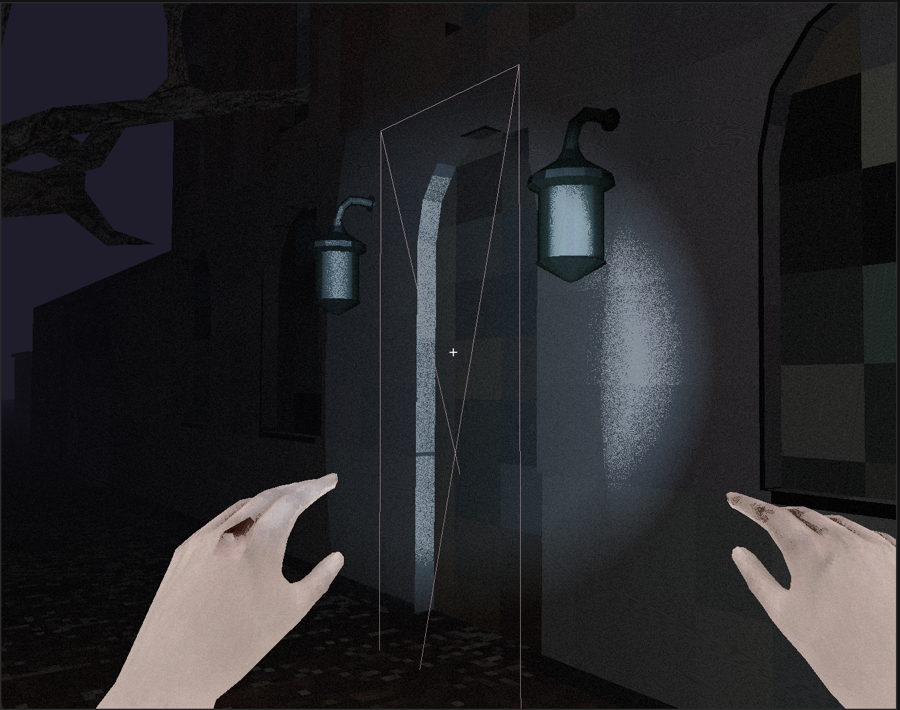
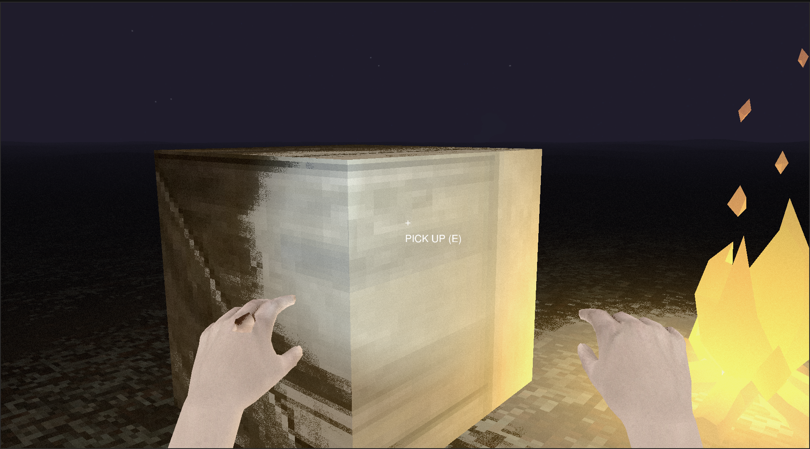

# 3d engine in opengl

 

## overview

3d engine built using opengl from scratch for linux. it includes a basic map editor and supports loading 3d models, dynamic lighting, collision detection and etc.

## features

- **audio** with `openal`
- **imgui** debug windows
- **animation**
    - sprite animation
    - skeletal animation
- **basic map editor**
  - drawing static objects
  - adding entities via json configuration
- **entity system**
  - pickups
  - separate collision detection
- **random terrain generation**
- **model loading**
- **postprocessing effects**
  - pixelated (low-poly) view
  - noise overlay
  - illuminance color adjustment
  - fog effects
  - dynamic lighting
    - flashlight
    - multiple light sources
- **text rendering**
- **collision detection** using `bullet3` physics engine

## libraries used

- opengl, glad, glfw (graphics and window/context management)
- glm (mathematics)
- imgui (debugging and ui)
- stb_image (image loading)
- assimp (model importing)
- bullet3 (physics and collision detection)
- openal (audio)

## setup & run

1. Install all required libraries and place them in the `libs` directory.
2. Compile and run by: `./run.sh`

